# 帧序 Framora

[English README](README.en.md)

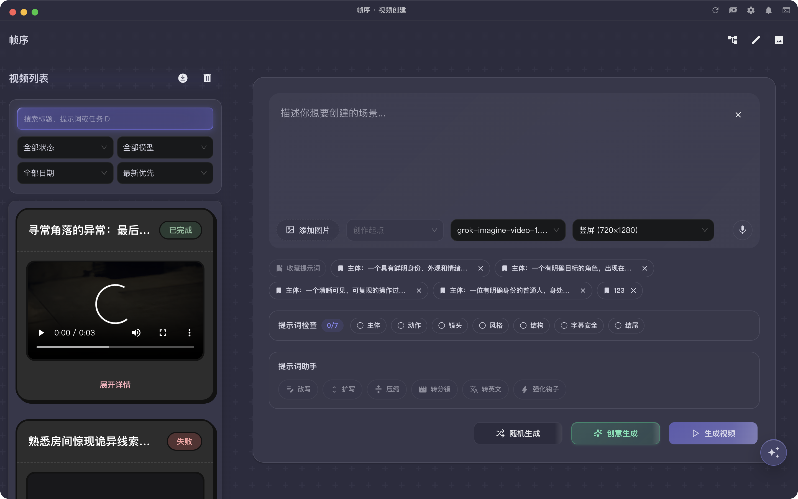

**帧序 Framora** 是一款桌面端 AI 视频创作工具，支持 macOS 和 Windows，面向短视频创作者、AI 影像实验者和内容运营团队。

你可以在一个应用里完成完整的创作链路：

- **AI 视频生成**：输入提示词或上传参考图，调用 Sora、Veo、Grok、Seedance 等主流视频模型生成短视频；
- **AI 工作流**：用节点画布把「脚本 → 分镜 → 生图 → 生视频 → 合成」编排成可复用的自动化流程；
- **视频编辑**：画布 + 多轨时间轴，组合视频、音频、图片、贴纸与字幕，本地导出成片；
- **图片编辑**：无限画布上进行局部重绘、一键消除、背景替换、高清放大、多图融合、文生图等 AI 图片处理；
- **本地优先**：所有配置与生成产物加密保存在你自己的电脑上，应用没有后端服务器，不上传你的任何数据。

---

## 目录

- [下载安装包](#下载安装包)
- [安装说明（重要）](#安装说明重要)
- [第一次使用：获取并配置 API Key](#第一次使用获取并配置-api-key)
- [全局设置](#全局设置)
- [页面功能介绍](#页面功能介绍)
- [免责声明](#免责声明)
- [安全与隐私说明](#安全与隐私说明)

---

## 下载安装包

前往 [GitHub Releases](https://github.com/yanquankun/framora-releases/releases/latest) 下载与你设备匹配的安装包：

| 平台 | 适用设备 | 安装包 |
| --- | --- | --- |
| Windows x64 | Windows 10/11 电脑 | `Framora-<版本>-windows-x64.exe` |
| macOS Apple Silicon | M1 / M2 / M3 / M4 芯片 Mac | `Framora-<版本>-mac-arm64.dmg` |
| macOS Intel | Intel 芯片 Mac | `Framora-<版本>-mac-x64.dmg` |

> 不确定自己 Mac 的芯片类型？点击屏幕左上角苹果菜单 →「关于本机」，查看「芯片」一栏：显示 Apple M 系列就下载 Apple Silicon 版，显示 Intel 就下载 Intel 版。

---

## 安装说明（重要）

当前版本的安装包**尚未进行 Apple 公证和 Windows 数字签名**（个人开发者证书成本较高，后续正式版本会补齐）。因此首次安装时系统会弹出安全提示，这是操作系统对所有未签名应用的统一拦截行为，**并非应用本身存在问题**。请按下面的步骤放行。

### macOS 安装步骤

1. 双击下载的 `.dmg` 文件，把 `Framora.app` 拖入「应用程序」文件夹。
2. 首次打开时，如果提示「无法打开 Framora，因为它来自身份不明的开发者」：
   - 在「应用程序」文件夹中**右键（或按住 Control 点击）Framora → 打开**，在弹窗中再点「打开」；
   - 或者打开「系统设置 → 隐私与安全性」，在页面底部找到被拦截的 Framora，点击「**仍要打开**」。
3. 如果提示「Framora 已损坏，无法打开」（常见于 macOS 较新版本），打开「终端」执行下面一条命令后重新打开应用：

```bash
xattr -cr /Applications/Framora.app
```

> 这条命令的作用是移除 macOS 给下载文件附加的隔离标记（quarantine），不会修改应用本身。

### Windows 安装步骤

1. 双击下载的 `.exe` 安装程序。
2. 如果弹出蓝色的「Windows 已保护你的电脑」（SmartScreen）提示：
   - 点击提示中的「**更多信息**」；
   - 再点击「**仍要运行**」。
3. 按安装向导完成安装（支持自选安装目录），完成后从桌面或开始菜单启动。

### 安装注意事项

- 请**只从本仓库的 GitHub Releases 页面下载安装包**，不要使用任何第三方渠道的转载版本，避免被植入恶意代码。
- 应用内置了视频处理所需的 ffmpeg 与语音识别组件，**无需额外安装任何运行时或依赖**。
- 应用会在标题栏提示新版本，届时可回到发布页下载更新。

---

## 第一次使用：获取并配置 API Key

帧序本身不提供模型算力，生成能力通过**兼容 OpenAI API 的中转服务**调用。你需要一个中转商的 API Key 才能使用生成功能。

### 获取 API Key

1. 打开中转商控制台（默认支持智创聚合：`https://s.lconai.com`）。
2. 注册或登录账号。
3. 在控制台中创建或复制你的 API Key（通常以 `sk-` 开头）。

### 在应用中配置

1. 启动帧序。**首次启动未配置 API Key 时，会自动打开设置窗口并定位到「API」页签**（之后也可以随时点击标题栏右侧的齿轮按钮打开）。
2. 在「API Key」输入框中粘贴你的 Key。
3. 「代理地址」保持默认 `https://s.lconai.com`；如果你使用其他兼容 OpenAI 协议的服务商，改成对方提供的地址即可。
4. 点击「保存」，返回主界面即可开始创作。

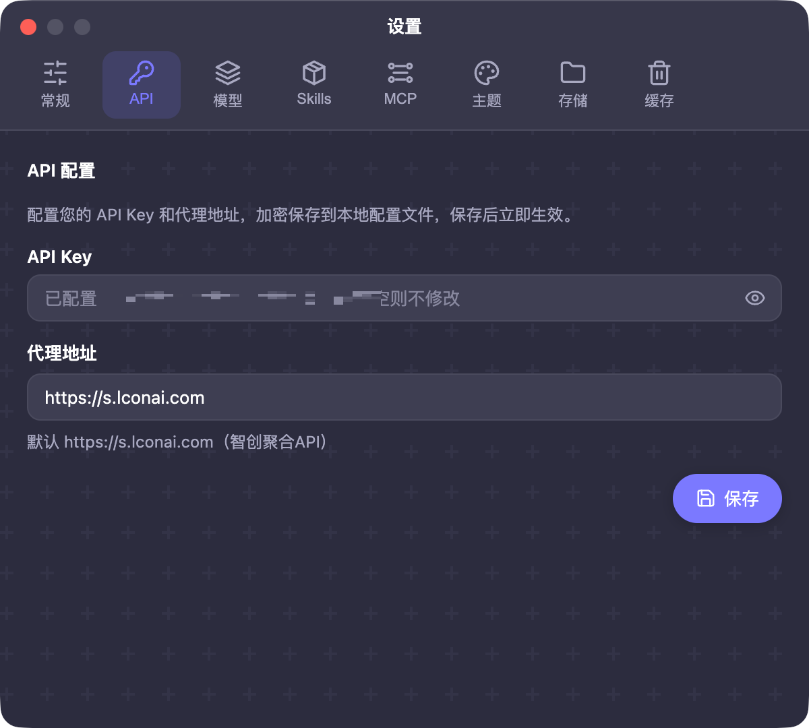

> **关于 API Key 的安全**：Key 会加密保存在你的本机（详见[安全与隐私说明](#安全与隐私说明)），只在调用你配置的中转商接口时使用。请勿把 API Key 发给他人，也不要出现在截图、公开仓库或日志中。

---

## 全局设置

点击标题栏右侧的**齿轮按钮**打开设置窗口，包含八个页签。

### 常规

查看应用版本、运行平台与运行模式，切换界面语言（中文 / English），语言变更即时同步到主窗口。

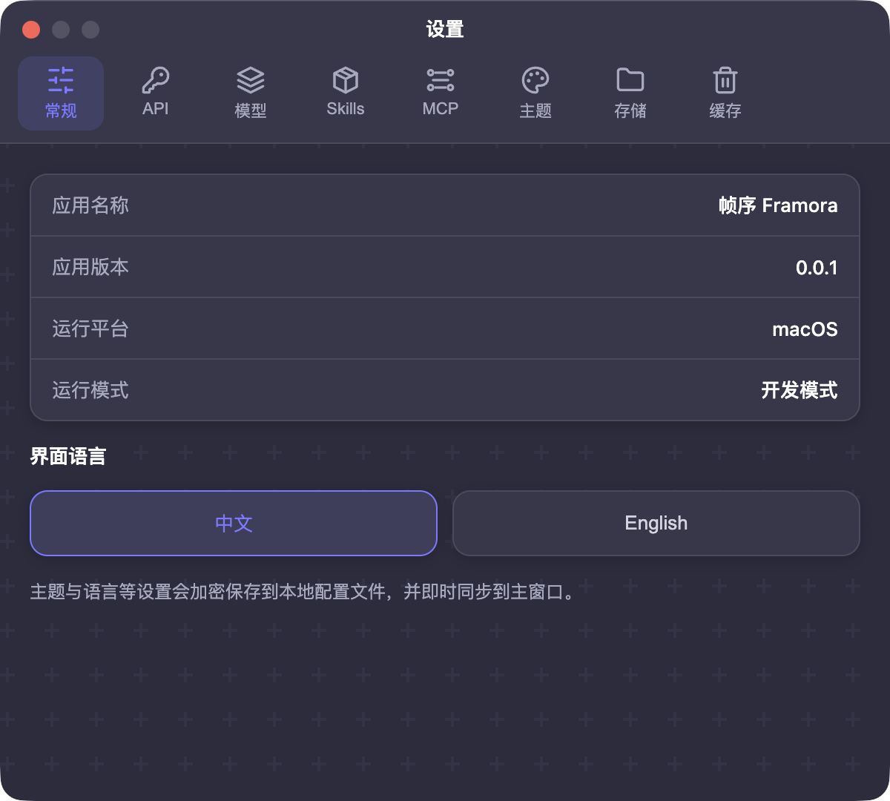

### API

配置 API Key 与代理地址，加密保存后立即生效（见上文[第一次使用](#第一次使用获取并配置-api-key)）。

### 模型

只读总览当前中转商**实时可用**的模型清单：按视频 / 图片 / 对话能力分组，展示模型名称、供应商与单价。清单与价格实时拉取自中转商平台，应用不做本地缓存落盘，支持手动刷新。

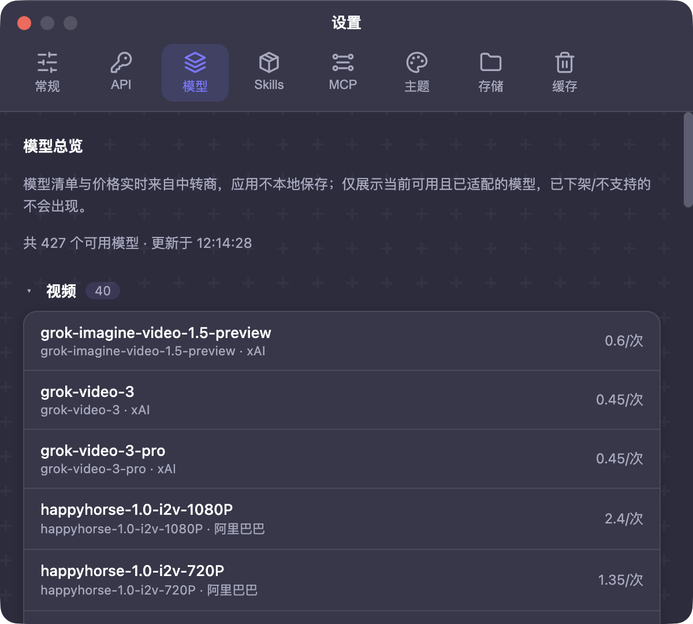

### Skills

管理符合 Claude Skill 规范的本地提示词增强包。内置短视频剧本、视频提示词等技能，也可以导入自己的 Skill，并按使用场景（工作流聊天、首页提示词助手等）授权启用。

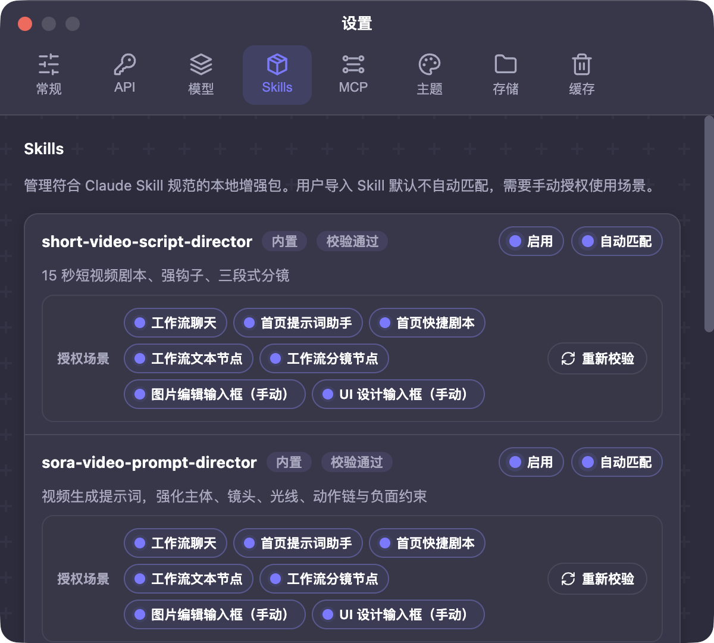

### MCP

把帧序的产品能力（视频生成、素材查询、工作流、发布等）以 MCP Server 的形式暴露给本机的 AI 工具（如 Claude、Cursor）调用。支持按「只读 / 生成 / 文件 / 发布」四组权限精细控制，带自检工具，默认关闭。

### 主题

内置浅色、深色、小黄鸭、简笔画风以及多套风格化主题，也可以跟随系统。主题变更即时同步到主窗口。

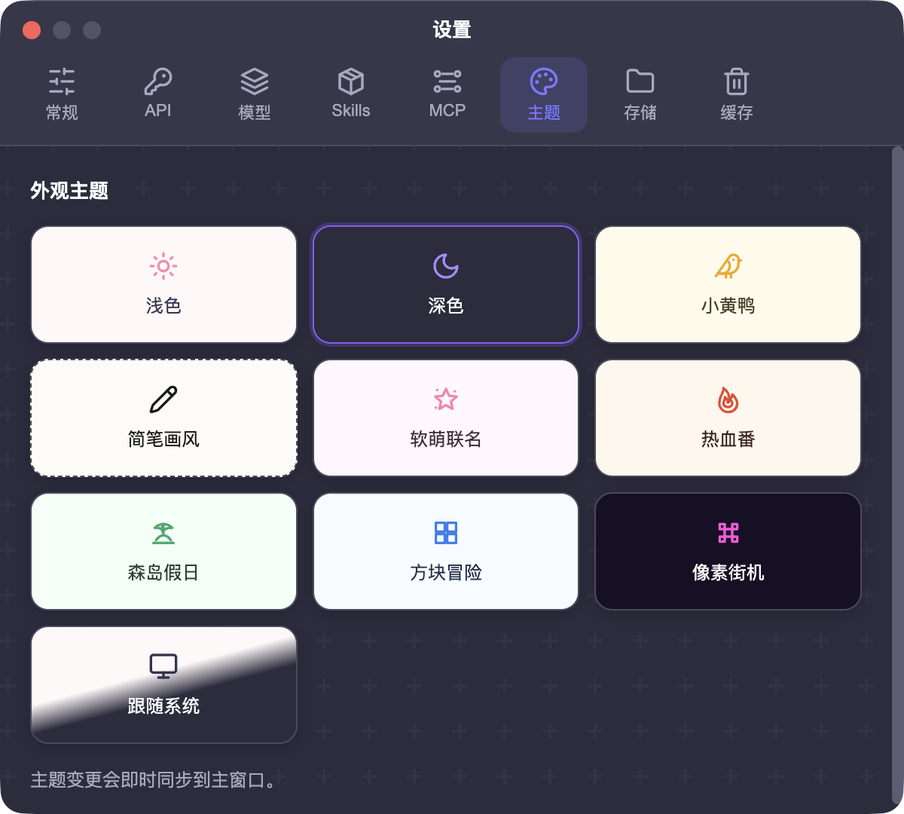

### 存储

查看与迁移数据目录（更改位置时数据自动完整迁移），设置统一的文件下载目录——视频生成、工作流、视频编辑页的下载与导出都会保存到该目录。

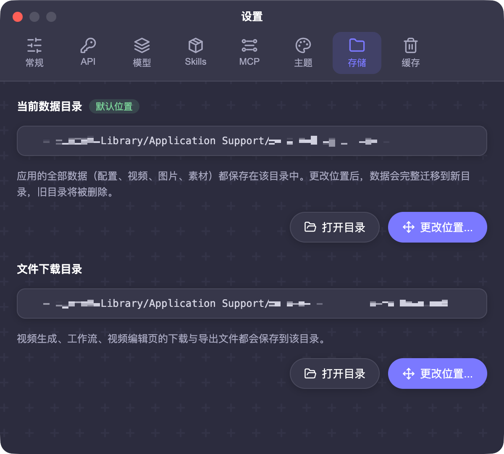

### 缓存

按分类查看各页面产物的磁盘占用（生成视频、编辑器素材、工作流产物、图片编辑会话、日志），支持单分类删除或一键全量清除。清除只删文件资源，**不会删除 API Key 与工作流配置**。

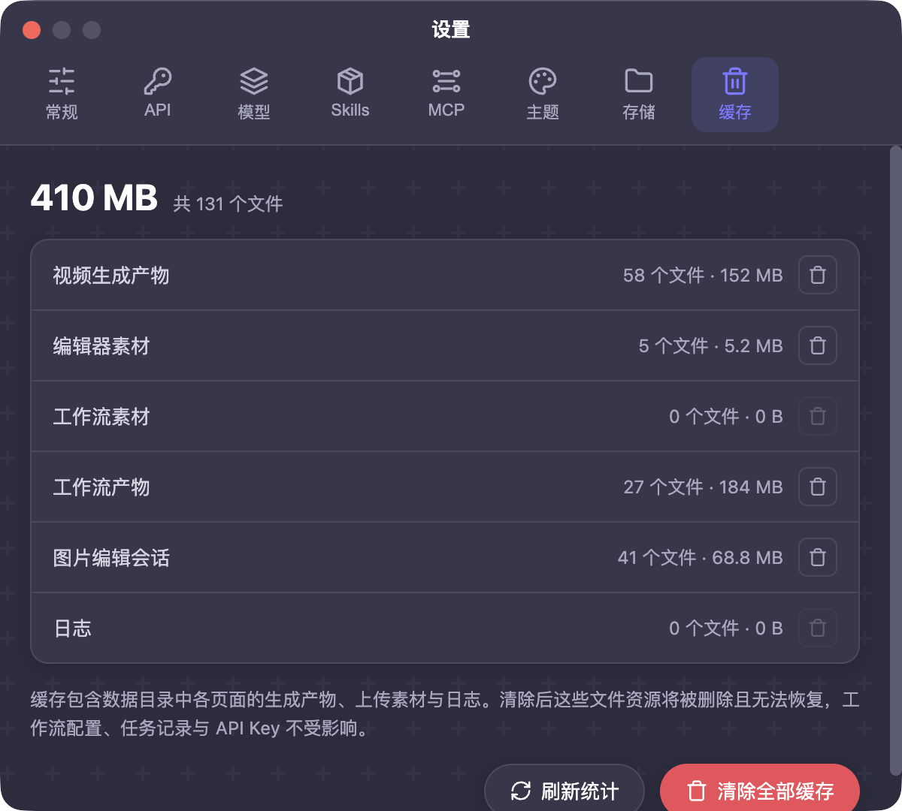

---

## 页面功能介绍

### 视频创建

主页用于快速生成 AI 视频：

- 输入提示词描述角色、场景、动作、镜头与风格，可上传参考图片做图生视频；
- 选择模型与画幅（如竖屏 `720x1280`），模型清单与价格实时来自中转商；
- 内置「提示词检查」（主体 / 动作 / 镜头 / 风格 / 结构等维度）与「提示词助手」（改写、扩写、压缩、转分镜、转英文、强化钩子）；
- 「创意工作台」帮你把热点、链接、素材说明整理成三段式分镜；
- 生成任务显示在左侧列表，可查看进度、预览、展开详情与下载；完成后视频与缩略图自动保存到本机。

### AI 工作流

用节点画布把复杂创作流程自动化：

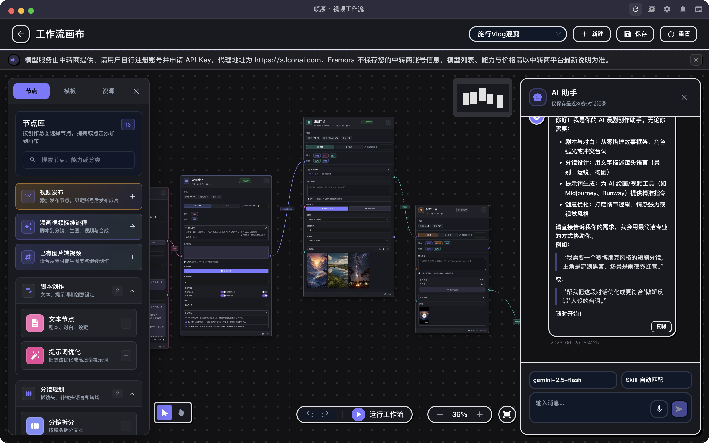

- 内置文本、提示词优化、分镜、生图、生视频、合成、视频发布等节点，连线传递文本 / 图片 / 视频结果；
- 可从模板一键开始（如漫画视频标准流程、图片转视频），也可以手动搭建；
- 无依赖关系的节点自动**并行执行**，画布实时显示每个节点的状态与进度；
- 右侧内置 **AI 助手**，辅助编写剧本、分镜与提示词；
- 工作流支持**后台运行**：切到其他页面继续跑，重启应用后还能从断点续跑；
- 生成的图片与视频自动归档到该工作流自己的目录。

### 视频编辑

把生成结果和本地素材剪成成片：

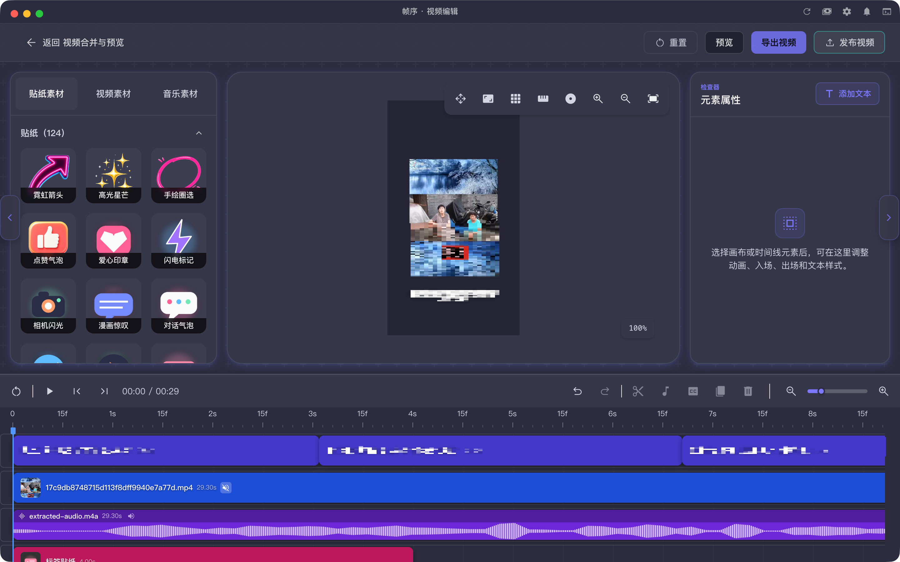

- 导入本地视频 / 音频 / 图片素材，应用**原地引用**原文件而不复制副本；
- 画布上自由调整素材位置、大小、层级，内置上百款贴纸；
- 多轨时间轴支持裁剪、分割、拖拽排列、音量控制与波形显示；
- 支持语音转字幕，字幕块可视化编辑；
- 导出由本地 ffmpeg 完成（优先硬件编码），保存到统一下载目录，全程不经过任何服务器；
- 原文件被移动或删除时素材会显示「已删除」标记，不会静默出错。

### 图片编辑

多图无限画布式的 AI 图片工作台：

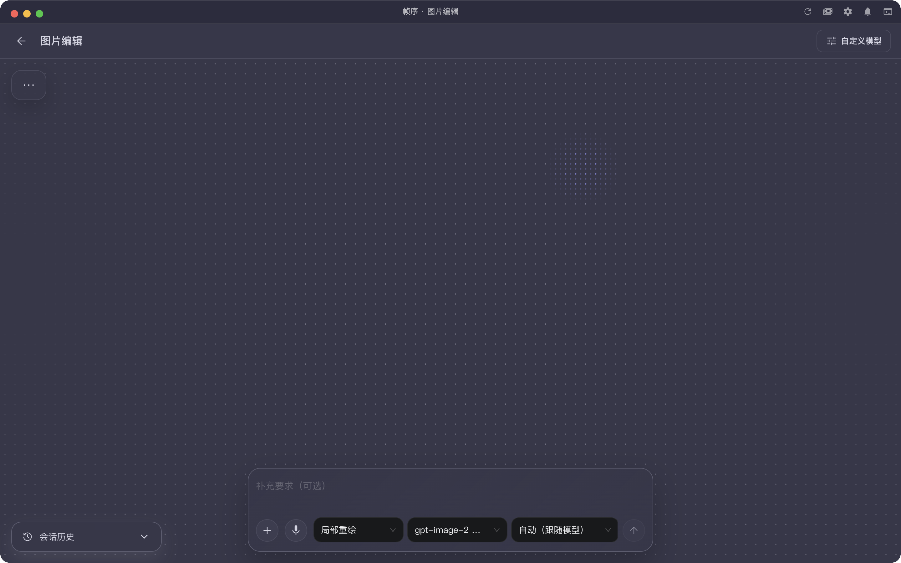

- 上传一张或多张图片，自由缩放平移画布；
- 支持**局部重绘、一键消除、文字替换、整图改写、背景替换、智能抠图、高清放大、老照片修复、多图融合、风格迁移、文字生图**等能力；
- 可框选局部区域作为重绘选区，也可以勾选多张图片作为融合 / 风格参考；
- 每次生成结果都作为新图层保留，方便对比迭代，支持单张与批量下载；
- 支持配置 OpenAI 格式的自定义图片模型（使用独立的模型地址与 Key）；
- 会话历史自动保存，随时回到之前的编辑现场。

### 使用记录与公告

- 标题栏的**费用按钮**可查看中转商返回的账单与调用记录（数据实时来自中转商，应用不留存）；
- 标题栏的**通知按钮**用于查看应用公告、使用提示与服务状态说明。

---

## 免责声明

在下载和使用帧序 Framora 前，请知悉并同意以下条款：

1. **软件按「现状」提供**。开发者不对软件的适用性、稳定性、无错误运行做任何明示或暗示的担保；因使用本软件产生的任何直接或间接损失，开发者不承担责任。
2. **AI 生成内容的责任归属**。所有视频、图片、文本均由你配置的第三方 AI 模型生成，生成结果的合法性、准确性与版权状态由使用者自行判断和承担。请勿使用本软件生成违法违规、侵权、虚假或有害内容。
3. **遵守法律与平台条款**。使用者应遵守所在地区的法律法规，以及所使用模型服务商、内容发布平台的服务条款。将生成内容发布到第三方平台（如抖音等）前，请确认符合平台规范并按要求标注 AI 生成。
4. **与模型厂商无关联**。本项目与 OpenAI、Google、xAI 及任何模型厂商、中转服务商均无官方关联。Sora、Veo、Grok 等名称与商标归各自权利人所有，本软件仅通过用户自行配置的 API 接口调用相关服务。
5. **API 费用**。模型调用产生的费用由你与中转服务商结算，与本软件无关。请自行了解中转商的计费规则，妥善保管账号与 Key。
6. **服务可用性**。中转商接口的可用性、模型上下架、价格调整均由服务商决定，本软件不做任何保证。

## 安全与隐私说明

帧序采用**本地优先**架构，我们对你的数据做出如下承诺：

### 不保存、不上传你的任何账号信息与密钥

- 应用**没有后端服务器，没有账号体系**——不需要注册，也没有任何「登录帧序账号」的环节；
- 你的 **API Key 只加密存储在你自己的电脑上**，仅在向你配置的中转商接口发起请求时使用，**绝不会发送给开发者或任何第三方服务器**；
- 开发者**无法看到也无法找回**你的 API Key，请自行妥善保管。

### 本地数据加密

- API Key、代理地址等配置使用 **AES-256-GCM** 加密存储，主密钥由系统级安全设施保护（macOS Keychain / Windows DPAPI），即使配置文件被拷走也无法直接读取；
- 生成的视频、图片、工作流产物与编辑素材全部保存在本机数据目录，位置可在「设置 → 存储」中查看和迁移；
- 你上传的本地素材默认**原地引用**，不会因为导入而复制副本；
- 清理缓存只删除文件资源，不会影响 API Key 与核心配置。

### 网络请求范围

应用运行期间只会访问以下网络目标：

| 请求目标 | 用途 |
| --- | --- |
| 你配置的中转商接口 | 模型清单 / 视频、图片、文本生成 / 账单查询 |
| GitHub（本仓库） | 检查新版本 |
| 匿名错误诊断上报 | 仅崩溃与错误日志，用于改进稳定性；**不包含 API Key、提示词、生成内容、媒体文件或个人信息** |
| 你主动绑定的发布平台 | 仅在你使用「视频发布」功能并完成授权后 |

### 建议

- 请从官方 Releases 页面下载安装包并核对文件名；
- 不要在截图、录屏、公开仓库中暴露完整 API Key；
- 如怀疑 Key 泄露，请立即到中转商控制台重置。

---

*文档中的界面截图仅供功能示意，涉及个人信息的部分已做打码处理；实际界面以最新版本为准。*
